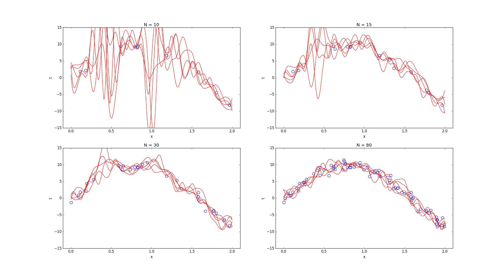
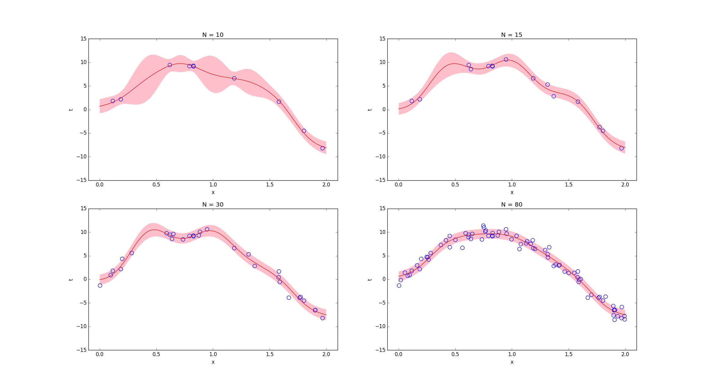

# Homework 2 for Machine Learning

## Environment

* ubuntu 16.04 LTS
* python2.7.12(using Pycharm 2017.2.3)
* extra modules: numpy, scipy, pandas

## Usage of each file

### Bayesian Inference for Gaussian (HW 1-2)

For the task 1-2, type the following command:

```
python bayesian_inference.py 1_data.mat
```
It will find the MAP solution of the covariance matrix, and compare it to the true covariance (using numpy.cov).
The output is like the following:
```
the true covariance is
[[ 0.30082961  0.39309777]
 [ 0.39309777  0.89266987]]
< N = 10 >
the MAP solution of covariance is
[[ 0.72927715  1.06310276]
 [ 1.06310276  2.47424115]]
error of MAP solution is 0.837507199995
< N = 100 >
the MAP solution of covariance is
[[ 0.36316943  0.45461111]
 [ 0.45461111  1.03532019]]
error of MAP solution is 0.0820042028936
< N = 500 >
the MAP solution of covariance is
[[ 0.31936913  0.39865164]
 [ 0.39865164  0.88775764]]
error of MAP solution is 0.00863987484804
```
I also try another approach, which will randomly generate muliple covariance matrix, and compute their probability to pick up the maximum one.

```
python bayesian_inference_random_generate.py 1_data.mat <number of data> <number of random covariance matrix>

#the output format
----testing----
the approximated MAP solution of covariance is
[[ 0.31907513  0.39842093]
 [ 0.39842093  0.88619125]]
the true covariance is
[[ 0.30082961  0.39309777]
 [ 0.39309777  0.89266987]]
error of approximated MAP solution is 0.00884261234455
the posterior probability is 15.4547626093
```

### Bayesian Linear Regression (HW 2-2, 2-3)

For the task 2-2, type the following command:
```
python bayesian_linear_regression.py 2_data.mat
```
This will plot four image similar to Fig. 3.9 on the testbook for different N, like the following image:


For the task 2-3, type the following command:
```
python bayesian_lin_regress_show_region.py 2_data.mat
```
This will plot four image similar to Fig. 3.8 on the testbook for different N, like the following image:
